# FANOOS incremental adaptation blueprint

## Non-negotiable separation rule

FANOOS is built in `FanoosLearn/fanooslearn` as a separate product. Legacy repositories are read-only behavioral references. No phase in this blueprint changes them, shares a database with them, imports their Git history, or makes FANOOS call them at runtime.

“Source module” in the tables means “evidence to study and test against.” Copying code or data is not implied. Any later extraction must be the smallest reviewed unit, remove product-specific assumptions, preserve provenance, and include FANOOS-owned tests.

## Strategy

Use a capability-by-capability strangler **outside** the legacy systems:

1. Capture observable behavior in sanitized FANOOS fixtures/contracts.
2. Implement the capability behind the canonical FANOOS API and data model.
3. Validate parity and tenant isolation locally/staging.
4. Enable only the FANOOS route/client for selected FANOOS users/workspaces.
5. Leave legacy products unchanged and available.
6. Consider an explicit export/import or user cutover only in Prompt 8 after backup, reconciliation and rollback rehearsal.

There is no shared-database or proxy-in-front-of-legacy strangler. This avoids coupling FANOOS availability and security to unrelated projects.

## Migration phases

```mermaid
flowchart LR
    P0[0 Evidence and contracts] --> P1[1 FANOOS repo foundation]
    P1 --> P2[2 Tenant DB and scoped RBAC]
    P2 --> P3[3 Local and production foundations]
    P3 --> P4[4 Core vertical slices]
    P4 --> P5[5 Content and exams]
    P5 --> P6[6 Telegram client and workers]
    P6 --> P7[7 Rehearsal and security gates]
    P7 --> P8[8 Optional approved cutover]
    P8 -. rollback .-> P7
```



Each phase is independently commit-able and testable. A later phase does not make an earlier incomplete authority “temporarily” live.

## Phase 0 — evidence and compatibility contracts

Status: completed by Prompt 1 and refined by this document.

- Keep the five Prompt 1 artifacts as the evidence index.
- Define sanitized fixtures for login outcomes, notes/resource projections, exam scoring/reporting, payment state transitions, bot link replay protection and protected-delivery authorization.
- Record legacy source commit/path provenance without embedding personal data, secrets, licensed content or runtime databases.
- Treat missing DentNote schema and generic calendar as new target-domain decisions, not hidden legacy implementations.

Exit gate: every feature selected for implementation has an evidence link, target owner, reuse decision, and negative isolation/security scenarios.

## Phase 1 — FANOOS repository foundation

Prompt ownership: architecture baseline now; implementation begins with the earliest prompt that creates code.

- Create only FANOOS-owned `apps`, `contracts`, `database`, `packages`, `ops`, `scripts`, and tests.
- Establish PHP module boundaries, Python package boundaries, OpenAPI/event schemas and one test entrypoint.
- Add ignores/secret scanning so the local operator specification and all runtime data cannot be committed.
- Provide local configuration examples containing names/placeholders only.
- Run all work locally. Do not activate supplied channel tokens or connect to production services.

Exit gate: clean clone can validate documentation/contracts and start an isolated local platform with fake providers; no legacy path is required.

## Phase 2 — tenant database and scoped RBAC

Prompt ownership: Prompt 3.

- Implement MariaDB/MySQL-compatible ordered migrations for hierarchy, workspaces, users, identities, memberships, roles, permissions, assignments and legacy aliases.
- Add academic/content/commerce/exam/grade/notification foundation tables only to the depth required by Prompt 3.
- Enforce workspace ownership through foreign keys, composite unique constraints, repository query shape and policy middleware.
- Build idempotent import interfaces against sanitized fixtures. Real legacy data is not imported in this phase.
- Add two-city/two-university/multi-membership/cross-tenant negative tests.

Exit gate: adding a workspace is a data operation; a representative cannot read/write a second workspace; migration reruns do not duplicate rows.

## Phase 3 — infrastructure, storage and operations foundation

Prompt ownership: Prompt 4.

- Inspect the new FANOOS website host using the separately supplied local credentials; do not inspect or alter legacy hosts.
- Verify PHP, relational database, TLS, document root, cron, filesystem permissions, upload limits, logs and backup options.
- Implement local and production `ObjectStore` adapters, pending/finalized uploads, checksums and private access.
- Establish immutable/versioned deploy artifact, health/readiness, migrations-before-code constraints, backup/restore and rollback.
- Establish transactional outbox/job claiming and fake/sandbox notification/payment adapters.
- Keep bot/media deploy disabled because no worker server currently exists.

Exit gate: staging/local deploy and rollback are reproducible; backup restore is verified; runtime data and secrets never enter Git/artifacts.

## Phase 4 — core vertical slices

Prompt ownership: Prompt 5.

Implement thin end-to-end slices in dependency order:

1. Authentication/session/account recovery.
2. Workspace selection and scoped administration.
3. Academic navigation and enrollment context.
4. Announcements/preferences.
5. Grades.
6. Forms.
7. Search read model.
8. Products/orders/provider verification.
9. Entitlement grant/revoke/query.

Each slice includes domain service, repository, policy, API, web UI, audit/outbox events and tests. A new UI never receives an alternate business-rule implementation.

Exit gate: web scenarios work through `/api/v1`/platform use cases, all writes are tenant-scoped, and payment callbacks are idempotent and provider-verified.

## Phase 5 — content, exams and protected-delivery contracts

Prompt ownership: Prompt 6.

- Implement resource/version/provenance/publication/binding entities on the Prompt 3 schema and Prompt 4 object storage.
- Adapt notes behavior and content transformation interfaces; define FANOOS DentNote as a documented content type rather than claiming a legacy schema exists.
- Adapt question parsers/build validators into deterministic import jobs with source checksums and provenance.
- Implement assessments and revisioned server-owned attempts; scoring and access remain server-side.
- Package protected PDF fingerprinting and attack fixtures in an isolated Python worker, but keep channel delivery disabled without worker infrastructure.
- Link purchasable content to the single commerce/entitlement authority.

Exit gate: one source can publish versioned products without code forks; web and future bot use one exam/entitlement contract; protected originals are never public.

## Phase 6 — Telegram bot and background workers

Prompt ownership: Prompt 7, after a worker server is available or explicitly local-only mode is requested.

- Implement a new FANOOS bot package using the canonical API; do not copy legacy bot configuration/state.
- Link channel identity through expiring one-time challenges and select active workspace explicitly.
- Adapt proven navigation and error/retry behavior to new FANOOS messages and branding.
- Make every content, grade, schedule, payment, entitlement and exam action an API client call.
- Claim protected/media jobs through internal service contracts; reauthorize before send and post idempotent delivery receipts.
- Retain only transport update offsets and bounded disposable cache locally.

Exit gate: deleting/rebuilding bot local state cannot remove or grant domain access; web and bot immediately agree on entitlement and revocation.

## Phase 7 — rehearsal and security gates

Prompt ownership: Prompt 8 pre-cutover phases.

- Run sanitized and approved staging import rehearsal with counts, checksums, alias mapping, rejects and rerun tests.
- Run tenant-isolation red team across guessed IDs, search, objects, notifications, admin exports, bot context and worker capabilities.
- Run payment duplicate/out-of-order callback, entitlement revocation, exam revision conflict, upload corruption and notification replay scenarios.
- Rehearse database/object/job backup restore and application rollback.
- Produce feature-parity and intentional-difference matrices.

Exit gate: no P0/P1 issue, restore/rollback meets approved targets, and every imported record has provenance/reconciliation evidence.

## Phase 8 — optional approved cutover

This is explicitly outside Prompt 2.

- Freeze only the approved source dataset, never source repositories.
- Take verified source export and FANOOS backup.
- Run idempotent import with stable alias maps and reconciliation.
- Enable FANOOS by controlled workspace/user cohort, not an all-system big bang.
- Monitor authorization, payment, queue, object and notification health.
- Roll back routing/enrollment on failed gates; do not destroy legacy data or services.

Legacy retirement requires a later, explicit owner decision after retention and data-access obligations are met.

## Feature source-to-target plan

Target paths are architectural destinations, not files created in Prompt 2.

| Order | Capability | Read-only source evidence | FANOOS target owner/path | Strategy | Dependencies |
| --- | --- | --- | --- | --- | --- |
| 1 | User/password/session | `DENT/api/{bootstrap,auth_api,auth_store}.php` and auth tests | `apps/platform/src/Identity` | Extract security behavior into FANOOS services/repositories | SQL foundation, audit |
| 2 | OTP/contact verification | DENT auth/SMS paths | `Identity/Verification` + `Integrations/Sms` | Adapt expiry/cooldown/attempt behavior; provider port | Identity, jobs, secret boundary |
| 3 | Tenant hierarchy/workspaces | DENT cohort catalog and route behavior | `Tenancy` + Prompt 3 migrations | Replace hard-coded model with data-driven hierarchy | SQL foundation |
| 4 | Membership/RBAC | DENT role functions and feature guards | `Tenancy/Authorization` | Adapt observed permission outcomes to scoped assignments | Identity, hierarchy |
| 5 | Account linking | DENT bot link modules; BOT onboarding/site client | `Identity/ChannelLinks`, `Integrations/ServiceAuth` | Adapt nonce/signature/replay semantics | Identity, service credentials, audit |
| 6 | Academic navigation | DENT curriculum/term data and Navid behavior | `Academics` | Replace constants with terms/courses/offerings; connector interface | Workspace/RBAC |
| 7 | Announcements/preferences | DENT notifications; BOT reminder/notifier behavior | `Notifications` | Adapt inbox/preferences/outbox/receipts | Membership, jobs |
| 8 | Grades | DENT grade store/API/JS and bot contract tests | `Grades` | Adapt own-grade/import/manage behavior | Academics, membership, audit |
| 9 | Forms | DENT forms modules | `Forms` | Adapt lifecycle/audience/submission; replace file store | RBAC, object storage, notifications |
| 10 | Search | DENT search contract | `Search` | Replace storage/index; preserve result/access expectations | Content/academics/forms projections, RBAC |
| 11 | Products/orders/payments | DENT payment state machine/gateway tests | `Commerce` | Adapt server totals, verified transitions, reconciliation; replace JSON | Identity, workspace, SQL, secret boundary |
| 12 | Entitlements | DENT exam/payment access; BOT subscriptions as evidence | `Entitlements` | Consolidate one grant/revoke/query authority | Commerce, content/product references |
| 13 | Resource catalog/interactions | DENT notes/store/UI | `Content` | Adapt CRUD/order/favorites/reports with explicit visibility | Workspace, object storage, RBAC |
| 14 | Upload/download | DENT direct chunks/download host; Voice artifact behavior | `Content/Objects` + Prompt 4 adapter | Adapt state machine/checksums; replace host-specific transports | Object storage, jobs |
| 15 | Content transforms/summaries | Voice transform/export patterns only | `workers/content` + `Content/Jobs` | Extract provider/artifact interfaces; never import Voice state/wallet | Content versions, jobs, entitlements if paid |
| 16 | DentNote | No canonical source found; nearest notes/transforms evidence | `Content/Formats/DentNote` | Create justified FANOOS schema/template with provenance | Resource model and product decision |
| 17 | Question import/build | DENT parsers/builders/quality checks | `workers/content` + `Exams/Import` | Adapt deterministic parsers/validators to normalized schema | Content versions, object storage |
| 18 | Exams/attempts/scoring | DENT exam API/store/JS; BOT exam tests | `Exams` | Adapt scoring/UI behavior; refactor attempt into revisioned server aggregate | Identity, offerings, entitlement |
| 19 | Payments for content/forms/exams | DENT clients and form/exam gates | Commerce + Entitlements contracts | Use shared order and entitlement IDs; no feature-local payment logic | Orders, product binding |
| 20 | Chat/collaboration | DENT chat/poll behavior | `Collaboration` (deferred until product-approved) | Preserve behavior fixtures; replace monolithic JSON/realtime implementation | Identity, membership, objects, notifications, jobs |
| 21 | File/paste sharing | DENT content-tools/file/paste behavior | `Content/Sharing` | Adapt possession-token semantics with expiry/revocation/workspace scope | Content, objects, audit |
| 22 | Raw HTML upload | DENT HTML uploader/sandbox evidence | `Content/InteractiveArtifact` only if security-approved | Reassess threat model; isolated origin/CSP or omit | Objects, security review |
| 23 | Institution/Navid connector | DENT Navid service/runner and BOT presentation behavior | `Integrations/InstitutionFeed` | Adapter with workspace/institution scope; no TUMS constants in core | Academics, notifications, jobs, secrets |
| 24 | Telegram bot | BOT UI/onboarding/site client behavior | `apps/telegram-bot` | New FANOOS client package; adapt interaction behavior only | Stable API, server runtime |
| 25 | Protected delivery | BOT dispatcher/fingerprint/detector/tests | `apps/workers/protected-media` + Content delivery API | Reproduce verified behavior from evidence; literal extraction requires explicit permission | Objects, entitlement, jobs, bot runtime |
| 26 | Web push/channel delivery | DENT push and BOT notifier patterns | `Notifications/Channels` | Adapt subscription/receipt/retry contracts | Notification outbox, secrets |
| 27 | Admin | DENT owner/manager behavior across APIs | Platform admin adapters over module use cases | New FANOOS UI; never create bypass/data ownership | Scoped RBAC, audit |
| 28 | Analytics/audit | DENT analytics/domain audit patterns | `Audit` plus privacy-safe analytics | Adapt event vocabulary/retention; immutable security audit | Identity/workspace/privacy policy |
| 29 | PWA/web shell | DENT shell/PWA interaction evidence | `apps/platform/assets/templates` | New FANOOS visual system; adapt safe offline/update behavior | Stable web routes/session rules |
| 30 | Deploy/backup/health | DENT/BOT/VOICE operational controls | `ops`, FANOOS scripts/workflows | Adapt gates and rollback; never reuse host credentials/paths | Prompt 4 host inspection |
| — | DIS survey | DENT DIS workflow | Generic `Forms` only if product-approved | Retire dedicated implementation | Forms |
| — | Message cards | DENT msg/content tools | Generic sharing/publication if approved | Retire duplicate implementation | Content/sharing |
| — | EndoSim catalog | DENT product data/assets | Commerce migration evidence only | Retire product-specific catalog from FANOOS source | Commerce reconciliation |
| — | Website private reader | DENT private reader remnants | None | Retire; protected worker is the supported direction | Reference/data check at cutover |
| — | Voice database/wallet | Voice product | None | Remains an independent product | Optional future service contract only |

## Dependency order and vertical-slice rule

```text
Identity
  -> Tenancy hierarchy
    -> Membership + scoped RBAC
      -> Academics
        -> Content metadata + object storage
          -> Commerce -> Entitlements
          -> Exams / Grades / Forms
            -> Notifications + Search projections
              -> Bot and protected-delivery clients
```

This is a dependency direction, not a mandate to finish every table before showing a feature. After the Prompt 3 foundation, implement one thin vertical slice at a time and add schema only when the slice needs it.

## Compatibility and anti-corruption layer

Legacy formats are accepted only by offline/import adapters under `scripts/import` or module-specific migration namespaces:

- input is read-only and copied to an immutable staging snapshot before parsing;
- parser produces normalized candidate records plus rejects/warnings;
- legacy identifier and source checksum are mandatory;
- validation occurs before a transaction writes target rows;
- rerun resolves the same alias/idempotency key rather than creating a duplicate;
- domain code never reads a legacy JSON/CSV/PHP file during normal FANOOS requests;
- no adapter writes back to a legacy path.

API compatibility is not required with legacy public URLs unless Prompt 8 identifies a concrete redirect/client need. FANOOS contracts should preserve behavior, not accidental endpoint names.

## Parity gates

| Gate | Minimum evidence |
| --- | --- |
| Identity | valid/invalid legacy credential fixtures, hash upgrade, rotation/revocation, OTP expiry/replay/rate controls |
| Workspace/RBAC | two institutions/workspaces, multi-membership user, representative isolation, platform operator explicit scope |
| Notes/content | ordering, visibility, favorites, report workflow, object finalization/checksum, publication sharing |
| Exams | question access before hydration, scoring fixtures, flags/review, revision conflict, retry-safe submit |
| Grades | own-grade projection, scoped import/manage, duplicate import and cross-workspace denial |
| Forms | audience rules, versioned submit, guest-token safety, private upload, duplicate request |
| Payments | server price, request/verify mapping, duplicate/out-of-order callback, reconciliation, secret redaction |
| Entitlements | verified grant, expiry/revoke, one result across web/bot, no cache-based grant |
| Protected delivery | authorization at queue/work/send, revocation race, algorithm regression, checksum, duplicate receipt |
| Operations | clean artifact, migration backup, health, rollback, restore rehearsal, no secret/runtime data in Git |

## Reversibility and rollback

- Schema migrations prefer expand→backfill→validate→switch-read→contract. Destructive contraction waits until cutover retention approval.
- Each importer records batch, source snapshot checksum, alias mappings, counts, rejects and reversal/compensation metadata.
- Feature enablement is per FANOOS workspace through canonical configuration; disabling does not delete data.
- Provider/channel adapters can be disabled independently while domain writes/outbox remain durable.
- Deploy rollback restores the previous application artifact without automatically reversing a committed forward-compatible schema.
- Data rollback uses verified backup plus reconciliation, not ad-hoc deletes.
- Legacy remains available; rollback never requires modifying it.

## UI migration strategy

FANOOS UI is designed from scratch as a FANOOS interface. For each feature, interaction parity tests capture valuable behavior before presentation work. Server projections and commands are shared; the web client cannot implement a second price calculator, role evaluator, entitlement resolver, exam scorer or publication policy.

Where offline/PWA behavior is added, cache keys include identity/workspace/version, protected data is excluded, and logout/revocation removes user-scoped cache.

## Deployment blueprint constraints

- The supplied site host is not touched in Prompt 2. Prompt 4 verifies its real capabilities before selecting deploy details.
- No worker/VPS is currently available, so Telegram/Bale/media processes remain local-only and disabled unless a later prompt explicitly provisions a runtime.
- Tokens and hosting credentials in the untracked operator file are not configuration source code and must never be committed.
- FANOOS receives its own database, object namespace, service identities, backups, logs and notification destinations.
- Legacy host paths, proxies, service names and backup archives are not reused.

## Completion checks for this blueprint

- No target rule contains Dentistry, TUMS, a year, professor, course or channel identifier.
- Web, bot and future app share a single API and domain authority.
- All tenant data has a workspace ownership route and scoped authorization.
- The architecture allows two institutions and a multi-workspace user without code branches.
- Every major audited feature has a source evidence path, target owner, strategy and dependency position.
- Migration is incremental, reversible and does not mutate or depend on legacy systems.

## HANDOFF_TO_PROMPT_3

### Chosen tenant boundary

`workspace` is the mandatory tenant boundary for authorization, configuration, commercial policy and tenant-owned data. It belongs to one cohort; a cohort may have multiple isolated workspaces. Hierarchy nodes above workspace are directory and optional authorization scopes, not implicit data-sharing boundaries.

### Selected persistence strategy

- One MariaDB/MySQL-compatible transactional relational database for canonical FANOOS state.
- Ordered checksumed migrations and a migration ledger.
- Opaque stable target IDs; legacy identifiers live in source-scoped alias tables.
- `workspace_id` on every tenant aggregate plus composite constraints/indexes.
- Object bytes behind `ObjectStore`; only metadata/checksum/classification/storage key in SQL.
- Transactional outbox and durable jobs in SQL initially; broker remains an adapter decision.
- Bot/search/cache state is non-authoritative and cannot grant access.

### Migration constraints

- Legacy projects are read-only references and never runtime dependencies.
- Prompt 3 uses generic/sanitized seeds only and runs no production import.
- Imports must be idempotent, batch-recorded, checksumed, reject-aware and safely rerunnable.
- No silent overwrite; conflicting mappings stop or quarantine the record.
- No destructive schema/data step without backup and a forward-compatible rollback/compensation plan.
- Tenant isolation is enforced in schema relationships, repositories, policies and negative tests.

### Legacy files/stores to map

- Auth: `storage/auth/users.json`, metadata/session shapes, cohort/role constants in `auth_store.php`.
- Academics: `dentistry_curriculum.php`, `academic_term7.php`, Navid normalized records.
- Content: cohort notes JSON, content-tools store, resource/user-state identifiers and object references.
- Exams: course/module registry, source question files, reports/attempts/flags/study state/activity store.
- Grades: cohort CSV plus meta files.
- Forms: definition/submission/payment/receipt records and private object references.
- Commerce: payment store collections/items/orders/provider snapshots/audit; never import credential values.
- Integrations: bot links/service nonces/delivery IDs and channel identities as external aliases.
- Notifications/audit: notification/preferences/delivery receipts and classified audit events.
- Bot SQLite: only mapping evidence for links, subscriptions, protected sources/issuances/delivery receipts; it is not imported as a second authority.

### Permission requirements

- Explicit actor, permission, scope type, scope ID and workspace context on every sensitive check.
- Separate authentication, membership/RBAC and entitlement decisions.
- Default deny; no generic `is_admin` bypass.
- Platform, institution, faculty, program, cohort, workspace, offering and narrow resource/assessment scopes.
- Explicit high-risk grants for membership changes, data export, payment reconciliation, entitlement override, protected-source management and audit access.
- A user’s roles in one workspace never authorize another workspace.

### Identifiers that must remain stable

- New FANOOS user/workspace/academic/content/assessment/order/payment/entitlement IDs after issuance.
- Source-system + entity-type + legacy-key alias tuples and their target IDs.
- Order public result token/idempotency key and provider authority/reference snapshots.
- Resource/version source checksum and provenance ID.
- Exam attempt ID and monotonic revision.
- Channel identity/link challenge/delivery event IDs.
- Protected issuance ID, source version/checksum, algorithm version and delivery receipt ID.
- Migration batch ID, source snapshot checksum and per-record import outcome.
