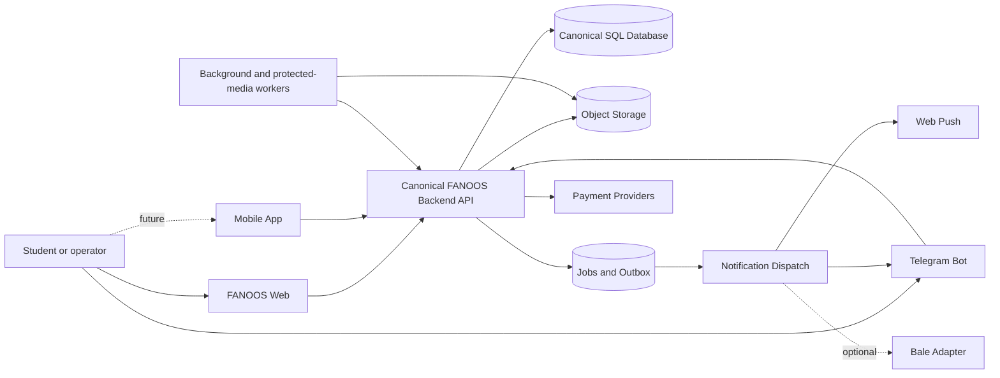
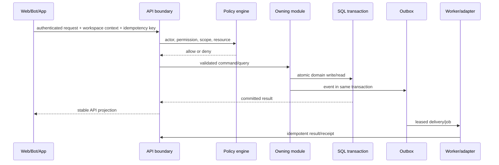

# FANOOS target architecture

Status: architecture baseline for Prompts 3–7

Date: 2026-09-06 (Asia/Tehran)

## Meaning of “migration” in this project

FANOOS is an independent product and repository. In these documents, “migration” means adapting proven behavior into newly owned FANOOS modules and, only in a later explicitly approved stage, importing selected data through controlled exporters/importers. It does **not** mean merging repositories, sharing databases, adding legacy projects as submodules, deploying into their environments, or changing their code.

The Dentistry1402TUMS, IntegratedDent1402Tums, and VoiceTranscriberBot trees remain read-only reference implementations. FANOOS has no runtime dependency on them.

## Architecture decision summary

| Topic | Decision |
| --- | --- |
| Repository | One FANOOS-only monorepo; no legacy history/source tree is imported wholesale |
| Application shape | PHP modular monolith for canonical backend/API and web, plus independently deployable Python bot/media workers |
| Canonical persistence | One transactional MariaDB/MySQL-compatible relational database for FANOOS domain state |
| Files | Object-storage abstraction; local ignored adapter for development, production adapter chosen after Prompt 4 host inspection |
| Async work | Transactional outbox and durable job records first; transport/broker can change behind an interface |
| Tenant boundary | `workspace` is the mandatory authorization, configuration, commercial, and data-isolation boundary |
| Identity | Global user identity with explicit memberships and scoped role assignments |
| Clients | Web, Telegram bot, and future app use the same versioned backend contracts; no client owns canonical domain state |
| UI | New FANOOS identity; proven interaction behavior can be adapted, but business rules stay server-side |
| Delivery | Website hosting can be used only if Prompt 4 verifies required PHP, SQL, filesystem, TLS, cron, and security capabilities; no bot deployment until a worker server exists |

## Why a FANOOS-only monorepo

The target repository contained only migration documentation, so there is no application structure to preserve. FANOOS needs coordinated changes across a PHP backend/web application, API contracts, database migrations, a Python Telegram client, and Python content/protected-delivery workers. Keeping these FANOOS components together allows one pull request to update a contract, its server implementation, generated/client fixtures, and cross-client tests atomically.

This is not a monolith of old projects. The monorepo contains only code authored or explicitly adapted for FANOOS. Legacy paths appear in audit/provenance documentation, never as source roots or Git subtrees.

Independent deployment remains possible: the platform, bot, and workers are separate deployable units even though they share a repository.

## Proposed repository layout

```text
FanoosLearn/
  apps/
    platform/                 # PHP modular monolith: web, API, admin, CLI
      public/
      src/
        Identity/
        Tenancy/
        Academics/
        Content/
        Exams/
        Grades/
        Forms/
        Commerce/
        Entitlements/
        Notifications/
        Search/
        Collaboration/          # Deferred until product scope approves chat
        Audit/
        Integrations/
      templates/
      assets/
      tests/
    telegram-bot/             # Python API client/channel adapter; no domain DB
    workers/                  # Python media/content/protected-delivery workers
  contracts/
    openapi/                  # Versioned public and internal HTTP contracts
    events/                   # Event schemas and compatibility fixtures
  database/
    migrations/
    seeds/                    # Generic development/reference seeds only
    fixtures/                 # Sanitized migration/parity fixtures
  packages/
    php/                      # FANOOS-only shared PHP primitives when justified
    python/                   # FANOOS-only API/event client primitives
  ops/                        # Prompt 4 environment/deploy/backup definitions
  scripts/                    # Repository validation and migration entrypoints
  docs/
    adr/
    fanoos-migration/
```

`apps/mobile/` is not created until the future app has an implementation prompt. Its contract is nevertheless supported by `/api/v1` from the beginning.

## System context



Only the backend accesses canonical tables. Worker access to domain state is through scoped internal contracts. A worker may access object bytes through short-lived object capabilities. The Telegram bot never reads or writes the database directly.

## Runtime and stack

### Canonical platform

- PHP remains the canonical application language because most proven account, notes, exam, form, payment, and admin behavior is PHP and the supplied website environment is cPanel-oriented.
- Code is organized with Composer/PSR-4-style modules and explicit application/domain/infrastructure layers. This is a placement rule, not a requirement to copy legacy global functions.
- The first web UI is server-rendered HTML with progressively enhanced browser modules. Client code handles presentation and offline interaction, not authorization, scoring, totals, or entitlement decisions.
- HTTP contracts are versioned under `/api/v1`. Internal service actions use a separate authenticated namespace and scopes.

No large PHP framework is mandated in Prompt 2. Prompt 3 may use a small migration/query dependency, but adopting a full framework requires an ADR showing that it reduces—not recreates—the audited behavior and remains deployable on the verified host.

### Canonical database

The selected persistence strategy is a MariaDB/MySQL-compatible transactional relational database:

- InnoDB-style transactions, foreign keys, unique constraints, and indexes are required.
- Every tenant-owned aggregate carries `workspace_id`; composite uniqueness includes that boundary where natural identifiers can collide.
- Application-generated opaque IDs are stable across imports and environments. Legacy keys are stored in mapping tables, not used as global primary keys.
- Database access is through module repositories. Raw client-selected workspace filters are never sufficient authorization.
- Schema changes are ordered migrations with a migration ledger, checksums, forward validation, and an explicit down/compensating plan where safe.

This choice matches the inspected PHP/cPanel deployment direction while fixing the non-transactional JSON/CSV authority problem. Prompt 4 must verify the exact server/version/capabilities before production. If that environment cannot supply required transactional SQL safely, changing the engine requires an ADR and compatibility run; it must not cause a second canonical database.

SQLite may be used for isolated unit fixtures or disposable bot update offsets, never as the canonical FANOOS production authority.

### Object storage

Binary content is separated from relational metadata behind an `ObjectStore` port:

- local development: ignored local directory with deterministic test adapter;
- production: cPanel/private filesystem or S3-compatible provider only after Prompt 4 verifies capabilities;
- database: object ID, owning workspace, version, checksum, size, detected MIME, classification, lifecycle and storage key;
- access: private by default, short-lived signed/capability download, explicit public publication;
- protected originals: available only to the protected worker, never from the public web root.

Storage keys are server-generated and do not encode user-controlled paths.

### Bot and workers

- `telegram-bot` is a channel adapter and conversation UI over the shared API.
- Durable account links, active workspace, entitlements, attempts, notifications, protected issuances, and delivery receipts are canonical backend records.
- The bot may retain only transport-required update offsets and a bounded disposable cache. Those records cannot grant access and can be rebuilt or reset.
- Media/content workers claim durable jobs through an authenticated internal API or a later broker adapter, fetch scoped object capabilities, and post idempotent results.
- No FANOOS bot is deployed until a suitable worker server/runtime is available. Tokens in the local operator file are not activated, copied to Git, or used in Prompt 2.

## Logical boundaries

| Boundary | Owns | Does not own |
| --- | --- | --- |
| Web | HTTP presentation, browser session interaction, accessibility, offline shell | Authorization truth, prices, scoring, entitlements |
| Backend/API | Use cases, validation, authorization, transactions, API projections | Channel-specific Telegram UI, binary processing |
| Identity | Users, authenticators, sessions, verified contacts, channel-link challenges | Workspace permissions or product entitlements |
| Tenancy/RBAC | Hierarchy, workspaces, memberships, role templates, scoped grants | Passwords, orders, content bytes |
| Academics | Terms, courses, sessions, offerings, enrollments | Grades and resource bodies |
| Content | Resources, versions, provenance, publications, bindings, object metadata | Payment verification and exam attempts |
| Exams | Assessments, question references, attempt revisions, scoring reports | Product pricing, raw payment callbacks |
| Grades | Grade items/imports/results and own-grade projections | Academic identity or payment state |
| Forms | Definitions, versions, submissions, response files | General chat or ad-hoc dedicated surveys |
| Commerce | Products, prices, orders, payment attempts, provider verification/reconciliation | Final permission evaluation |
| Entitlements | Grants/revocations and access decisions derived from orders/admin policy | Gateway credentials and callbacks |
| Notifications | Notification records, preferences, outbox, channel delivery receipts | Domain truth that caused an event |
| Search | Rebuildable tenant-scoped index/projections | Canonical content or ACL decisions |
| Admin | Authorized orchestration and projections across modules | An `is_admin` bypass or independent data tables |
| Audit | Append-only security/domain/operator events with retention classes | Mutable domain state |
| Integrations | Institution connectors and signed service identities/nonces | Canonical academic/payment/identity state |
| Background jobs | Scheduling, claim/lease/retry/dead-letter/result metadata | Unscoped access or a parallel domain database |

## Shared backend and data flow



Rules:

1. The server resolves workspace membership; a client header or route parameter never grants scope.
2. Commands that can be retried—payment callbacks, bot actions, submissions, uploads, worker completions—carry an idempotency key and stable actor/service identity.
3. Domain write and outbox event commit together. Network delivery occurs after commit.
4. API projections omit secrets and fields outside the actor’s scope.
5. Search/cache results are reauthorized before sensitive content or downloads are returned.

## Tenant and workspace architecture

### Hierarchy

```text
Country
  -> Province/State
    -> City
      -> Institution/University
        -> Campus (optional)
          -> Faculty
            -> Department (optional)
              -> Program/Major
                -> Cohort/Entry
                  -> Workspace (tenant boundary)
```

Optional nodes are represented by nullable relationships at the hierarchy edge, not by placeholder rows required in application code. A workspace belongs to exactly one cohort. A cohort may have more than one workspace when separate operational spaces are required; those workspaces do not share data implicitly.

Hierarchy nodes are directory/reference entities. They help discovery and inheritance but are not authorization boundaries by themselves unless a scoped role assignment explicitly targets one.

### Global/shared data

- canonical user identity and verified contact/channel identities;
- normalized geographic/institution/program directory entries;
- permission definitions and platform-owned role templates;
- provider types, resource-type vocabulary and platform feature definitions;
- platform audit/security configuration;
- platform-owned content library records, if created explicitly.

“Global” is never represented as an unexplained `workspace_id = NULL`. Platform-owned resources have an explicit platform owner/scope and explicit publication grants to workspaces.

### Workspace-scoped data

- memberships, workspace role assignments and settings;
- academic terms, course offerings, sessions and enrollments in that operational space;
- resources, versions, publications, course/session bindings and user interactions;
- assessments, attempts, flags, reports and grade records;
- forms, submissions, uploads and responses;
- products/prices offered by the workspace, orders, payment attribution and entitlements;
- announcements, preferences, notification receipts and bot active context;
- chat/collaboration if later approved;
- connector configuration, search documents and domain audit events.

### Sharing without isolation leaks

A resource has one owning scope: a workspace or the explicit platform library. Sharing creates a `publication/grant` edge to each target workspace with its own visibility, lifecycle and optional commercial policy. The target workspace never gains write ownership of the source version. Forking creates a new resource with provenance to the source.

## Identity, membership, and scoped RBAC

Authentication answers “who is the actor?” Membership and RBAC answer “what may this actor do here?” Entitlement answers “does this actor currently have commercial/policy access to this product/resource?” These are separate checks.

### Scope types

The minimum scope vocabulary is:

- `platform`;
- `institution`;
- `faculty`;
- `program`;
- `cohort`;
- `workspace`;
- `course_offering`;
- `resource` or `assessment` for narrow delegation.

Scope ancestry is resolved from canonical relationships, not string prefixes. High-risk permissions such as payment reconciliation, membership administration, protected-source management, and data export require explicit grants; broad parent roles do not silently acquire them unless the role template says so.

### Permission evaluation

1. Authenticate human or service actor and reject revoked credentials/session.
2. Resolve the requested workspace and canonical resource scope.
3. Verify active membership where the action is workspace-bound.
4. Load applicable active role assignments for that exact scope and allowed ancestors.
5. Check the named permission and any domain condition such as ownership, entitlement or assignment.
6. Deny by default and produce a safe audit event for sensitive operations.

There is no generic `is_admin` bypass. Platform operators use explicit platform-scoped assignments. A cohort representative is a role template normally assigned at one workspace/cohort scope. The same user may have unrelated roles in multiple workspaces; grants are not unioned across workspace contexts.

### Initial permission families

- `workspace.view`, `workspace.manage_settings`, `membership.view`, `membership.manage`;
- `academic.view`, `academic.manage`;
- `resource.view`, `resource.create`, `resource.review`, `resource.publish`, `resource.manage_protected`;
- `exam.take`, `exam.manage`, `grade.view_self`, `grade.manage`;
- `form.submit`, `form.manage`, `form.export`;
- `commerce.purchase`, `commerce.manage_catalog`, `payment.reconcile`, `entitlement.grant`;
- `notification.receive`, `notification.broadcast`;
- `audit.view`, `integration.manage`.

Prompt 3 may split a permission only when an audited behavior or isolation test requires it.

## API and service contracts

### Public/client API

- Versioned JSON HTTP resources under `/api/v1`.
- Web session cookie with CSRF for browser mutations; future app uses revocable token/session credentials.
- Explicit workspace context in route or request, validated against server-side membership.
- Stable opaque IDs, ISO timestamps, machine codes plus localized user messages.
- Cursor pagination for growing collections.
- Idempotency key required for retryable creates and external callbacks.
- Error classes distinguish unauthenticated, forbidden, not found in scope, conflict/revision mismatch, validation, rate limit and provider unavailable.

### Internal worker/channel API

- Separate service identities and least-privilege action scopes.
- Signed requests include key ID, timestamp, nonce, body digest and idempotency key until a stronger host-native identity mechanism is available.
- Nonces and idempotency outcomes are durable for their replay windows.
- Workers receive only fields and short-lived object capabilities required for the job.
- Results include source job ID, algorithm/processor version, output checksum and stable completion key.

### Contract evolution

OpenAPI/event schemas are reviewed artifacts. Additive changes are preferred; breaking changes require a new API/event version and a compatibility window. Web and bot contract tests run against the same examples.

## Consistency and transaction boundaries

- Identity, membership/RBAC, commerce/payment, and entitlement updates use database transactions.
- A verified payment and the event that requests entitlement evaluation commit atomically through the outbox. Access is granted only from a persisted verified transition.
- Exam answers use attempt ID plus revision; duplicate/reordered writes cannot silently replace newer state.
- Resource metadata and object upload use a pending→verified→published state machine; an object is not visible before checksum/type/finalization succeeds.
- Notification and bot delivery use at-least-once processing with idempotent receipts.
- Cross-module reads occur through application queries or stable read projections; modules do not update one another’s tables directly.

## UI strategy

FANOOS receives a new visual identity, information architecture and component vocabulary. No Dentistry/TUMS route tree, logo, labels, CSS theme or static product page is the visual baseline.

Reuse applies to interaction evidence:

- session and account recovery behavior;
- resource ordering/favorites/reporting;
- quiz navigation, flags, timing and review;
- payment result/retry/reconciliation states;
- form audience/submission behavior;
- bot onboarding, back navigation and protected-delivery status.

Each rule is implemented once in the backend/domain layer. Web/browser code may validate for usability but the server repeats authoritative validation. The future app and bot consume the same projections and commands rather than porting server rules.

PWA/offline caching is partitioned by user/workspace, never caches protected content, and purges user-scoped data on logout/workspace removal.

## Deployment topology blueprint

```text
Internet
  -> TLS/Web host
       -> PHP platform (web + /api/v1 + admin)
       -> canonical relational database
       -> private object adapter
       -> cron/short PHP worker where host permits

Future worker server (not currently available)
  -> Telegram bot process
  -> media/content/protected-delivery workers
  -> authenticated internal API to platform
  -> scoped object access
```

Prompt 4 must inspect the supplied FANOOS website host before selecting paths, database version, cron model or upload limits. It must not assume the legacy host topology. The bot/media tier stays local and disabled until a server with process supervision, private state, required PDF tools, outbound connectivity and health monitoring exists.

The untracked local operator file contains environment details and credentials. Prompt 2 neither uses nor publishes those values. Prompt 4 must move required values to a proper ignored/secret boundary and should rotate them if exposure risk is identified.

## Model-level scenario validation

| Scenario | Resolution |
| --- | --- |
| TUMS → Dentistry → Entry 1402 | Directory nodes and cohort are data rows; its workspace owns memberships, offerings and content publications. No `1402` branch exists in code. |
| Another university → Medicine → another entry | Create hierarchy/cohort/workspace records and role assignments. The same modules/routes operate unchanged. |
| Representative manages only own workspace | Assignment has representative role at that workspace scope; policy denies other workspace resources even if IDs are guessed. |
| User belongs to multiple workspaces | One global user has multiple memberships; each session/request/channel selects an active workspace and evaluates only that scope. |
| Shared or exclusive resource | One owner plus explicit publication grants; exclusive resource has only owner-workspace publication. Shared targets cannot modify the source version. |
| Bot and web see one entitlement | Both call the same entitlement query in the canonical backend. Bot cache cannot grant access; revocation is rechecked before protected send. |

All six scenarios fit without institution, program, entry, or channel-specific application branches.

## Architecture invariants

1. FANOOS is independent; legacy systems are never runtime dependencies.
2. One canonical backend owns domain decisions and one relational database owns durable domain state.
3. Every tenant-owned read/write is resolved and authorized within a workspace scope.
4. No client, bot, worker, cache, search index or object store grants identity, role, payment or entitlement truth.
5. Secrets and runtime data never enter Git, API projections or general audit logs.
6. External callbacks and asynchronous work are verified, idempotent and auditable.
7. Protected content is private by default and reauthorized immediately before delivery.
8. Legacy remains untouched and available until later parity/import/cutover approval.
9. New UI does not duplicate business rules.
10. Production deployment waits for Prompt 4 environment verification and the relevant stage gates.
