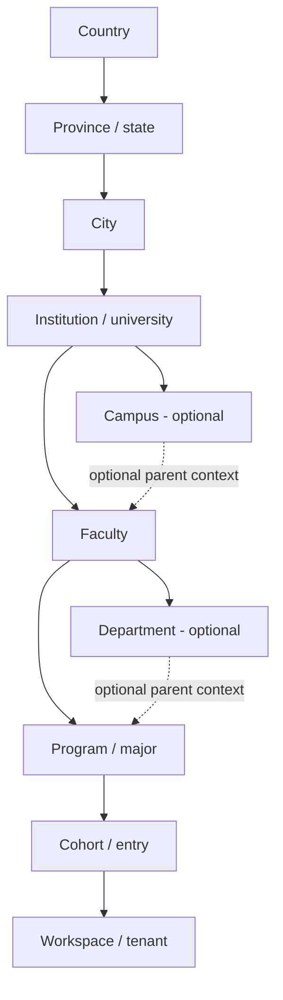
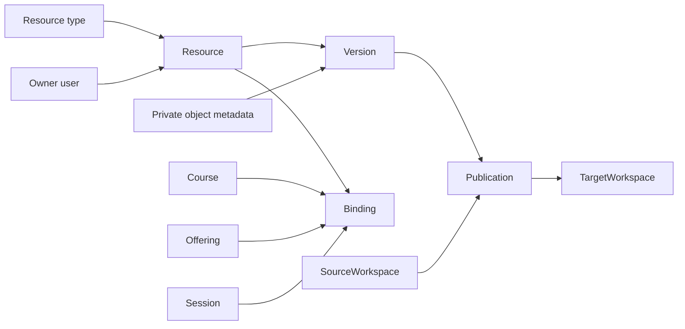

# FANOOS canonical data model

Status: implemented Prompt 3 schema baseline

Date: 2026-09-06 (Asia/Tehran)

## Scope and authority

The SQL migrations in `database/migrations/` are the first executable FANOOS data authority. They are new FANOOS assets in this repository. No legacy database, repository, server, or runtime is connected to this schema, and no legacy record has been copied.

MariaDB/MySQL-compatible InnoDB is the selected canonical store. The runner records each migration name and SHA-256 checksum in `schema_migrations`, uses a database advisory lock, applies files in lexical order, and rejects a changed migration after application. The initial DDL uses `CREATE TABLE IF NOT EXISTS` so an interrupted first deployment can be resumed; established migrations are immutable and later changes must be additive numbered files.

## Directory and tenant hierarchy

`directory_*` rows are governed directory data. They organize discovery and scope ancestry but do not grant access. `tenant_workspaces` is the tenant root. A workspace belongs to exactly one cohort; multiple workspaces may point at the same cohort without sharing tenant data.

The optional campus and department edges use nullable foreign keys. Composite foreign keys ensure a selected campus belongs to the faculty's institution and a selected department belongs to the program's faculty.

## Identity and authorization

`iam_users` is a global identity. Verified identifiers, authenticators, and sessions are separate tables so credential material and public identity are not mixed. Authenticators store only a password/secret digest; sessions store a token digest.

Workspace access is composed from two independent records:

1. `tenant_workspace_memberships` establishes the user's active relationship to one workspace.
2. `rbac_role_assignments` grants a role template at one explicit `rbac_scopes` row.

Scopes form a bounded parent chain from a resource/workspace to cohort, program, faculty, institution, and platform. The application authorizer validates the canonical target scope, exact workspace, active assignment window, allowed assignment scope, permission, and membership requirement. It denies by default. There is no `is_admin` column or unscoped bypass.

## Academic model

| Table | Purpose | Tenant constraint |
| --- | --- | --- |
| `academic_terms` | Workspace academic period | Unique `(workspace_id, term_key)` |
| `academic_courses` | Workspace course catalog item | Unique `(workspace_id, course_code)` |
| `academic_course_offerings` | Course offered in a term/section | Composite FKs force course and term into the same workspace |
| `academic_course_sessions` | Ordered class/session occurrence | Composite FK to same-workspace offering |
| `academic_enrollments` | Membership enrolled in an offering | Composite FKs force membership and offering into the same workspace |

The same human-readable course code can exist in different workspaces. It cannot be duplicated within one workspace.

## Content model

- A resource has one owning `workspace_id`, one owner user, a type, lifecycle, and optimistic version.
- A resource version is immutable application data identified by `version_no`; it references structured JSON or a verified object record.
- `content_objects` contains object metadata only. Bytes remain behind an object-storage adapter and are private by default.
- A binding has exactly one target kind: workspace, course, offering, or session. CHECK constraints reject ambiguous targets.
- Cross-workspace sharing is an explicit publication edge from source workspace/version to target workspace. It does not transfer write ownership.

## Domain foundations

Prompt 3 creates relational foundations, not complete product behavior, for these later modules:

| Family | Baseline records now | Deferred behavior |
| --- | --- | --- |
| Commerce | products, price versions, immutable order snapshots, payment attempts | Provider adapters, callback verification, reconciliation UI |
| Entitlements | scoped user grants with source, validity, and revocation | Product/access policies and decision API |
| Notifications | canonical messages and per-user/channel recipients | Audience expansion and channel delivery workers |
| Exams | assessments, immutable versions, revisioned attempts | Question editing, timers, scoring, reports |
| Grades | gradebooks, items, results | Imports, publishing workflow, student projections |
| Schedule | workspace/offering events | Recurrence expansion, calendars, reminders |
| Operations | idempotency, transactional outbox, durable jobs, append-only audit | Dispatchers, retention jobs, operational UI |

The payment and exam columns establish safe states and versioning but do not claim to implement Prompt 5 or Prompt 6.

## Tenant isolation invariants

1. Every tenant-owned aggregate stores `workspace_id`; it is never inferred from a URL, year, institution, or user-selected string.
2. Parent/child links inside tenant data use `(id, workspace_id)` foreign keys wherever a child could otherwise point across tenants.
3. Workspace-local natural keys include `workspace_id` in their unique index.
4. Read authorization receives the target scope and exact workspace, then resolves permissions from canonical records. Filtering a query by itself is not authorization.
5. Platform-scoped records use an explicit `scope_type = 'platform'`; nullable workspace fields are accepted only where a CHECK constraint pairs them with that scope.
6. A global identity may belong to multiple workspaces, but assignments and entitlements do not flow between them.
7. Shared content requires an explicit publication row. A sibling or ancestor relationship never creates implicit access.

The integration test creates two independent city/university/faculty/program/cohort/workspace branches, proves scoped authorization outcomes, and attempts an invalid cross-workspace offering write that the database rejects.

## Identifiers, lifecycle, and concurrency

- Application-created entities use UUIDv7 strings. They are opaque to clients and time-sortable without encoding tenant data.
- Legacy identifiers are not primary keys. Their HMAC digests live only in `migration_legacy_id_mappings`.
- Mutable aggregates have an integer `version` or `revision` for optimistic concurrency.
- Directory/content entities use archive timestamps; privacy-sensitive identities and object metadata also support a deleted state/timestamp.
- Financial, audit, mapping, and attempt history is not soft-deleted. Corrections use explicit status, revocation, void, or compensating records.
- All stored timestamps are UTC `DATETIME(6)`; presentation converts them to the user locale/timezone.

## Index strategy

Indexes follow the expected authorization and operational access paths:

- workspace plus status/date for tenant lists;
- user plus membership/assignment state for policy checks;
- scope plus active assignment state for RBAC;
- object/resource owner and lifecycle for content;
- order buyer/status and payment authority digest for commerce;
- notification recipient/status for inbox delivery;
- outbox/job availability and lease state for workers;
- audit scope/subject/actor plus occurrence time;
- source-system/entity/digest and target type/ID for import reconciliation.

Query plans and index cardinality must be checked with production-shaped synthetic data before cutover. Prompt 4 must confirm the actual MariaDB/MySQL version supports the CHECK, JSON, recursive CTE, and advisory-lock behavior used here.

## Prompt 5 implementation extension

Migration `0006_core_platform.sql` turns the Prompt 3 foundations into the core application boundary without changing their ownership model:

- sessions gain a selected workspace, CSRF digest and non-authoritative client metadata;
- login attempts provide digest-keyed throttling without retaining raw network or identifier values;
- forms use definition/version/submission records, and search uses a disposable workspace-keyed projection;
- products point to an entitlement target scope; orders and payment attempts gain callback/idempotency/failure evidence;
- entitlement grants gain an idempotent grant key and optimistic version;
- content access policies compose RBAC, entitlement and bounded download TTL;
- reconciliation and grade-import batches preserve operator/idempotency evidence;
- notification preferences remain separate from message/recipient authority.

All new tenant-owned records carry `workspace_id` and use composite foreign keys where a cross-workspace reference is otherwise possible. Payment callback tokens, provider authorities, sessions, CSRF values and login keys are persisted only as digests.
